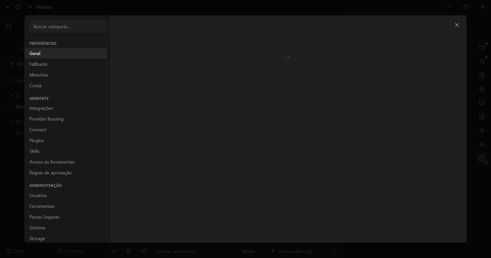
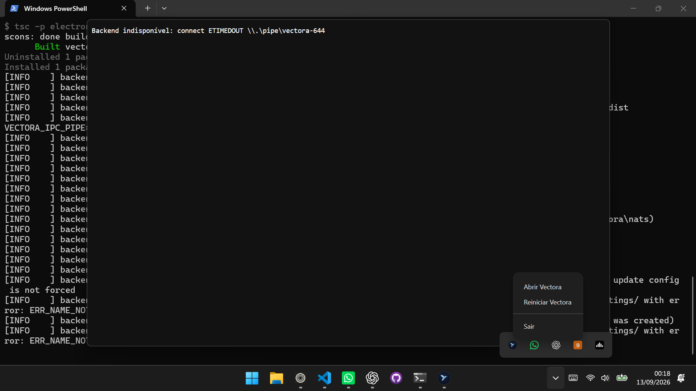

# Incidente: settings e reconexão do desktop

Estas capturas registram o incidente corrigido neste PR: o painel de configurações permanecia vazio e o tray mostrava timeout no named pipe após o Electron ser reiniciado.

